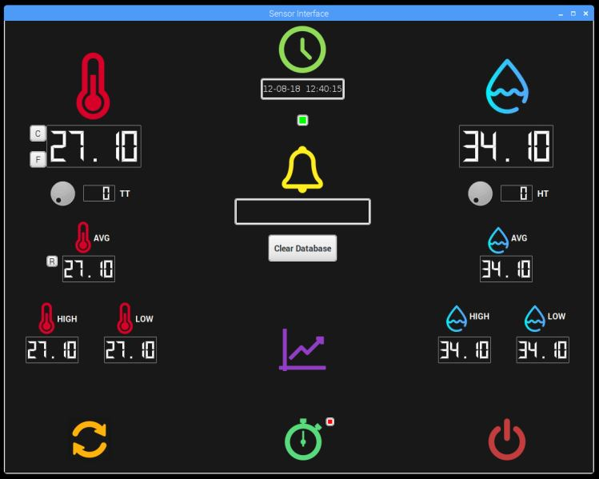

   # MQTT/AWS Lambda with Raspberry Pi and Protocol Comparison
   
   ### Created By: Preshit Harlikar and Smitesh Modak
  
  
  
   #### This project demonstrates development of a rapid prototype of a stand-alone temperature monitoring device with a local user interface. The temperature and humidity sensor used is DHT22 which is interfaced with Raspberry Pi. A User Interface is created for the temperature and humidity sensor using PyQT. Create local database using SQL. Client Server communication using MQTT and AWS as Broker. A QT interface to remote display the data from server and graph of retrieved data. A button on client QT start profiling of MQTT, Websockets and CoAP. The data received from the server are sent to the server and received back and the roundtrip time is profiled for each protocol.
   
   ## Installation Guide
   ### To run this project on Raspeberry Pi, you need to install Qt and PyQt using,
         sudo apt-get install qt5-default pyqt5-dev pyqt5-dev-tools
         sudo apt-get install qttools5-dev-tools
   
   ### Some packages have to be installed
         sudo apt-get update
         sudo apt-get install build-essential python-dev python-openssl git
         
         npm install socket.io
         
         wget -qO- https://deb.nodesource.com/setup_10.x | sudo -E bash -
         sudo apt-get install -y nodejs

   ### Install boto3
         pip install boto3
         
   ### Install websocket client
         pip3 install websocket-client
   
   ### Install paho-MQTT
         pip3 install paho-mqtt
  
   ### Install 
  
   ### Now clone the pre-built Adafruit library for DHT22
         git clone https://github.com/adafruit/Adafruit_Python_DHT.git && cd Adafruit_Python_DHT
         sudo python3 setup.py install
         
   ### Clone this repository and run the program
         git clone https://github.com/hpreshit/eid-fall2018 && cd DHTsensorAWS
   
   ### To run local QT
         python3 SensorMain.py
   
   ### To run server for three protocols
         python3 server.py
   
   ### To run the client QT
         cd client
         python3 SensorMain.py
         
   ### AWS Lambda function
         cd client
         lambda.js
    
   ## Project Work
   ### The DHT22 temperature and humidity sensor is interfaced with the Raspberry Pi and an Interactive GUI is created to display the Temperature and Humidity values. The GUI has the basic functionalities like:
   #### 1. Requesting current values from of the temperature and humidity from the DHT22
   #### 2. Display the values of temperature and humidity as well as the time of request
   #### 3. A button on the RPi3 server display allows changing units to degrees C or F
   #### 4. Take temp/humidity readings every 5 seconds and display in a QT UI 8 values: the last, average, highest, and lowest readings for both temp and humidity with time/date of each reading 
   #### 5. The sensor RPi3 sends the data to AWS IoT via MQTT which triggers a lambda event.
   #### 6. The Lambda function calculates the average, min and max for both temperature and humidity and adds the data to SQS queue.
   #### 7. The QT on client RPi3 has a button to request last 30 values from the queue. 
   #### 8. The client RPi3 displays a graph of all the 8 values with start and stop timestamps.
   #### 9. A button on the RPi3 client display allows changing units to degrees C or F
   #### 10. A button on client QT starts profiling of roundtrip time for three protocols: MQTT, Websockets and CoAP
   #### 11. The results are displayed in textual format as well as a graphical comparison of roundtrip time of three protocols is displayed. 
   
   ## References
   #### 1. https://docs.aws.amazon.com/index.html#lang/en_us
   #### 2. https://boto3.amazonaws.com/v1/documentation/api/latest/index.html
   #### 3. https://docs.aws.amazon.com/AWSSimpleQueueService/latest/SQSDeveloperGuide/welcome.html
   #### 4. https://lobster1234.github.io/2017/06/25/boto-and-sqs/
   #### 5. http://www.steves-internet-guide.com/python-mqtt-publish-subscribe/
   #### 6. https://pypi.org/project/websocket-client/
   #### 7. https://pythonspot.com/matplotlib-bar-chart/
   
   
   
