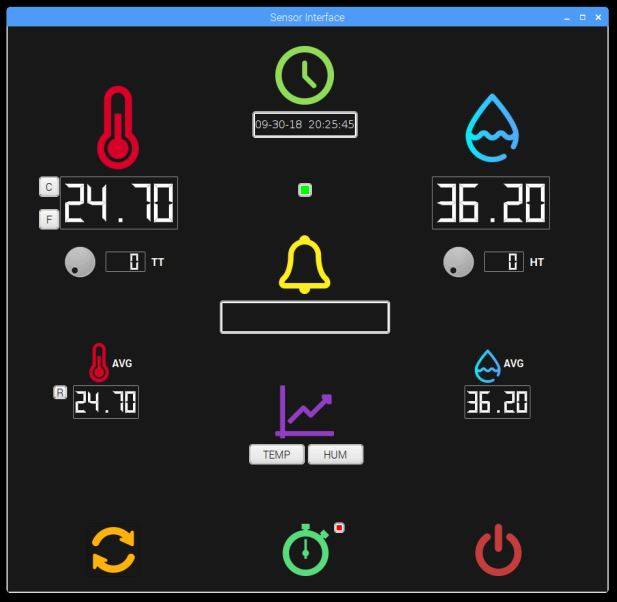

   # Project 2 : Remote Websocket/Web Page UI
   
   ### Created By: Preshit Harlikar and Smitesh Modak
  
  
  
   #### This project demonstrates development of a rapid prototype of a stand-alone temperature monitoring device with a local user interface. The temperature and humidity sensor used is DHT22 which is interfaced with Raspberry Pi. A User Interface is created for the temperature and humidity sensor using PyQT. Create local database using SQL. Client Server communication using Websockets. A HTML webpage to remote display the data from server. 
   
   ## Installation Guide
   ### To run this project on Raspeberry Pi, you need to install Qt and PyQt using,
         sudo apt-get install qt5-default pyqt5-dev pyqt5-dev-tools
         sudo apt-get install qttools5-dev-tools
   
   ### Some packages have to be installed
         sudo apt-get update
         sudo apt-get install build-essential python-dev python-openssl git
         
         npm install socket.io
         
         wget -qO- https://deb.nodesource.com/setup_10.x | sudo -E bash -
         sudo apt-get install -y nodejs

   
   ### Now clone the pre-built Adafruit library for DHT22
         git clone https://github.com/adafruit/Adafruit_Python_DHT.git && cd Adafruit_Python_DHT
         sudo python3 setup.py install
   
   ### Install Tornado
         pip install tornado
         
   ### Clone this repository and run the program
         git clone https://github.com/hpreshit/eid-fall2018 && cd DHTsensorUI
   
   ### To run local QT
         python3 SensorMain.py
   
   ### To start Websocket server
         python3 server.py
   
   ### To run the client html
         cd client
         open client.html
 
   
   ## Project Work
   ### The DHT22 temperature and humidity sensor is interfaced with the Raspberry Pi and an Interactive GUI is created to display the Temperature and Humidity values. The GUI has the basic functionalities like:
   #### 1. Requesting current values from of the temperature and humidity from the DHT22
   #### 2. Display the values of temperature and humidity as well as the time of request
   #### 3. A button on the RPi3 server display should allow changing units to degrees C or F
   #### 4. Take temp/humidity readings every 5 seconds and display in a QT UI 8 values: the last, average, highest, and lowest readings for both temp and humidity with time/date of each reading 
   #### 5. The sensor RPi3 runs a web server to allow the remote RPi3 client to request and display data using WebSockets as the communication protocol between the sensor RPi3 and the remote display RPi3 client
   #### 6. The remote client display developed as an HTML web page that will in a browser on the remote RPi3 and talk to the sensor RPi3’s webserver to request data for display
   #### 7. Indicate any error conditions in the connection
   #### 8. Provide eight buttons to request, read from the server.
   
   ## Project Additions
   ### The additional features added to the project are:
   #### 1. Login Screen for client Pi
   #### 2. Display Graph of Temperature and Humidity on Client 
   
   
   ## References
   #### 1. https://github.com/jaredwolff/nodejs-websocket-example
   #### 2. https://os.mbed.com/cookbook/Websockets-Server
   #### 3. https://www.merixstudio.com/blog/websockets-how-it-works-and-how-use-it/
   #### 4. https://www.jaredwolff.com/blog/raspberry-pi-getting-interactive-with-your-server-using-websockets/
   #### 5. https://github.com/jaredwolff/nodejs-websocket-example/blob/master/public/index.html
   #### 6. https://www.w3schools.com/html/
